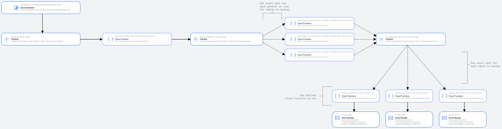

# gcp-backup-exercise

## Summary
A workflow to process data backups on Google Cloud Platform (GCP). This includes the architecture and pseudocode required to orchestrate, execute, and log the backup process for all projects within a GCP organization.

## Workflow Diagram

## GCP Components Used

### Google Cloud Scheduler
#### Purpose:
Used to manage the automated scheduling of the `gcp-backup-exercise` workflow.

#### Usage:
- [x] Setup a scheduled job **daily at 11PM EST** to run the GCP backup workflow.
- [x] Setup an alerting policy to send an email for jobs that catch failures in the Cloud Functions steps.

### Google Pub/Sub
#### Purpose:
Used as an event messaging queue to help kick-off various Google Cloud Functions scripts throughout the workflow.

#### Usage:
Pub/Sub topics for Cloud Scheduler and Cloud Functions to interact with and help orchestrate each step in the `gcp-backup-exercise` workflow.

The Pub/Sub topics will all be created in a general project called `gcp-platform-team-project`. This way, the topics don't need to be replicated across each individual project that holds tables to be backed up.

| Topic name | Description |
|------------|-------------|
|**start-backup-process** | Generic Pub/Sub topic as the entry point to `gcp_backup_exercise/projects.py` |
|**check-project-tables** | Generic Pub/Sub topic as the entry point to `gcp_backup_exercise/scan.py`, publishes message to topic with `project_to_check` field with project id to check which tables are eligible to be backed up |
|**run-bq-backup-to-cs** | Generic Pub/Sub topic as the entry point to `gcp_backup_exercise/backup.py`, publishes message to topic with `table_to_backup` field with the table id to backup in a given project |

### Google Cloud Functions
Used to execute Python scripts at various points throughout the workflow. Pseudocode of the example Python scripts are included in the `gcp_backup_exercise/` directory.

**Important Note:** I chose Google Cloud Functions for the execution of the Python scripts below, but this could alternatively be hosted/executed via **Google Cloud Run** using a Python container image, too.

#### Usage:
#### `gcp_backup_exercise/projects.py`
Script to scan a GCP organization to find all projects within the orgnization. For each project within the organization, publish a message to the `check-project-tables` Pub/Sub topic with a project id to check for tables to backup.

#### `gcp_backup_exercise/scan.py`
Script to scan a GCP project to find all of the datasets and tables within the project and see if any tables have been modified within the last 24 hours. If so, publish a message to the `run-bq-backup-to-cs` Pub/Sub topic with the table to backup to Cloud Storage.

#### `gcp_backup_exercise/backup.py`
Script to backup a table in BigQuery to Cloud Storage.

### Google Cloud Storage
Used as a data storage location for any tables that are backed up from BigQuery. The GCS bucket **will be in the same project as the BigQuery table**, and will also sit in the same region. Because Cloud Storage is immutable, this can ensure the backup data cannot be altered. If needed, a retention policy can be added to the bucket/path to clean out old backups.

### Google Cloud Logging
#### Purpose:
Used to collect and centralize success & failure logs for each step of the workflow.

#### Usage:
Called in each Cloud Function script to output information about what is occuring within the worfklow. Cloud Logging is also linked to Cloud Scheduler so Cloud Scheduler can send an email notification on a job failure.
